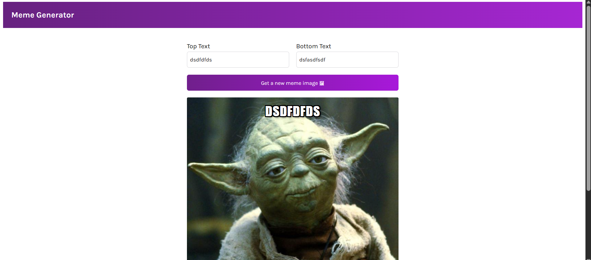

# Meme Generator (React + TypeScript)

A simple meme generator built with React and TypeScript.
It fetches meme templates from the Imgflip API and lets you add custom top and bottom text.

## Preview



## Features

- Fetches meme templates from `https://api.imgflip.com/get_memes`
- Random meme image generator
- Custom top and bottom text inputs
- Built with Vite for fast development

## Tech Stack

- React 19
- TypeScript
- Vite

## Getting Started

### 1. Install dependencies

```bash
npm install
```

### 2. Start the development server

```bash
npm run dev
```

### 3. Build for production

```bash
npm run build
```

### 4. Preview production build

```bash
npm run preview
```

## Project Structure

```text
src/
	components/
		Header.tsx
		Main.tsx
	App.tsx
```

## Notes

- Meme templates are loaded once when the app mounts.
- If the API is unavailable, meme loading may fail until refresh/retry.
